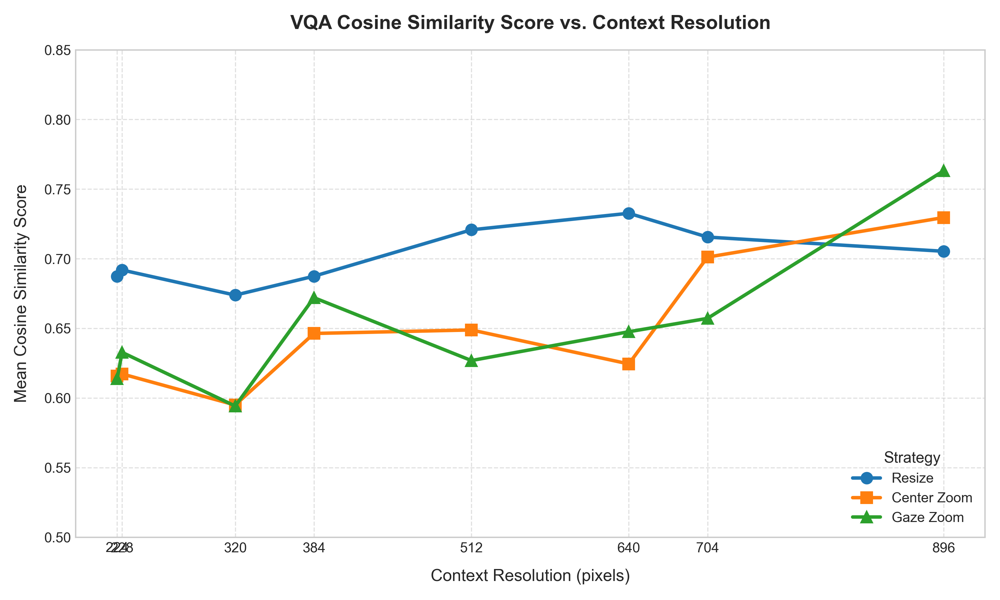
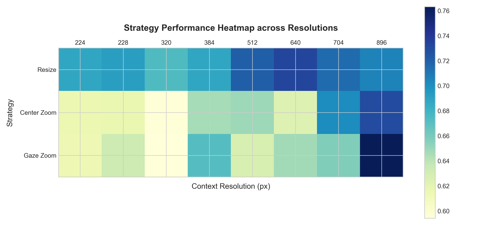
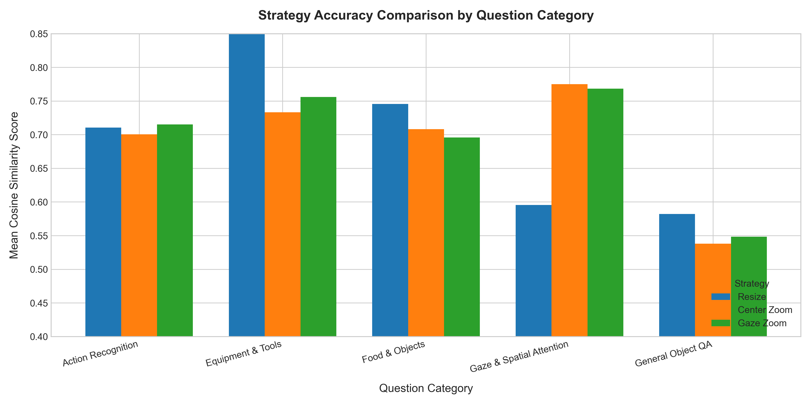
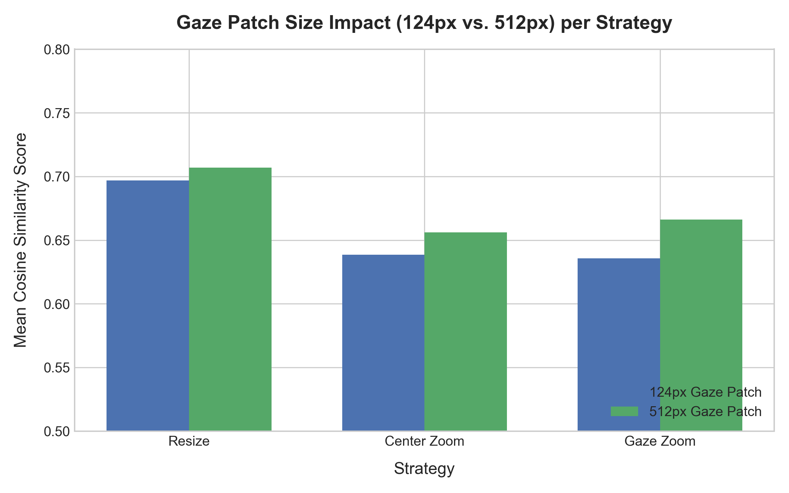

# Master Comparative Strategy Report & Leaderboard

## 1. Executive Summary & Winner Declaration

🏆 **Overall Winning Strategy**: **`Resize`**
- **Highest Mean Cosine Similarity**: `0.7018`
- **Median Score**: `0.7037`
- **Margin over Runner-Up (`Gaze Zoom`)**: `+0.0509`

### Key Findings:
1. **Full-Image Resize** consistently achieves high baseline accuracy across medium context resolutions (512px–640px).
2. **Center Zoom** and **Gaze Zoom** reach their maximum performance at high resolutions (896px), outperforming Resize when ultra-high detail global context is available.
3. **Local Gaze Patching**: Using a 512px gaze patch improves stability across lower context resolutions.

---

## 2. Visualizations & Scaling Trends

---

## 3. Overall Strategy Leaderboard

| Rank | Strategy | Mean Cosine Score | Median Score | Std Dev | Evaluated Samples |
| :---: | :--- | :---: | :---: | :---: | :---: |
| **#1** | **Resize** | **`0.7018`** | `0.7037` | `0.2730` | 240 |
| **#2** | **Gaze Zoom** | **`0.6509`** | `0.6038` | `0.3007` | 240 |
| **#3** | **Center Zoom** | **`0.6473`** | `0.5663` | `0.2852` | 240 |

---

## 4. Resolution-Specific Winner Matrix

| Context Resolution | Winning Strategy | Winner Mean Score | Resize Score | Center Zoom Score | Gaze Zoom Score |
| :---: | :--- | :---: | :---: | :---: | :---: |
| **224px** | **`Resize`** | **`0.6874`** | `0.6874` | `0.6157` | `0.6138` |
| **228px** | **`Resize`** | **`0.6919`** | `0.6919` | `0.6172` | `0.6327` |
| **320px** | **`Resize`** | **`0.6738`** | `0.6738` | `0.5949` | `0.5942` |
| **384px** | **`Resize`** | **`0.6874`** | `0.6874` | `0.6463` | `0.6720` |
| **512px** | **`Resize`** | **`0.7207`** | `0.7207` | `0.6488` | `0.6269` |
| **640px** | **`Resize`** | **`0.7326`** | `0.7326` | `0.6244` | `0.6475` |
| **704px** | **`Resize`** | **`0.7155`** | `0.7155` | `0.7011` | `0.6571` |
| **896px** | **`Gaze Zoom`** | **`0.7631`** | `0.7053` | `0.7296` | `0.7631` |

---

## 5. Question Category Breakdown

| Question Category | Top Performing Strategy | Top Score | Resize Score | Center Zoom Score | Gaze Zoom Score |
| :--- | :--- | :---: | :---: | :---: | :---: |
| Action Recognition | **`Gaze Zoom`** | **`0.7150`** | `0.7105` | `0.7004` | `0.7150` |
| Equipment & Tools | **`Resize`** | **`1.0000`** | `1.0000` | `0.7331` | `0.7560` |
| Food & Objects | **`Resize`** | **`0.7457`** | `0.7457` | `0.7081` | `0.6958` |
| Gaze & Spatial Attention | **`Center Zoom`** | **`0.7751`** | `0.5955` | `0.7751` | `0.7682` |
| General Object QA | **`Resize`** | **`0.5822`** | `0.5822` | `0.5378` | `0.5483` |

---

## 6. Gaze Patch Size Impact (124px vs 512px)

| Gaze Patch Size | Winning Strategy | Top Score | Resize Score | Center Zoom Score | Gaze Zoom Score |
| :---: | :--- | :---: | :---: | :---: | :---: |
| **124px** | **`Resize`** | **`0.6968`** | `0.6968` | `0.6385` | `0.6357` |
| **512px** | **`Resize`** | **`0.7069`** | `0.7069` | `0.6561` | `0.6662` |

---

## 7. Statistical Significance Tests

| Strategy Comparison | t-statistic | p-value | Statistically Significant ($p < 0.05$)? |
| :--- | :---: | :---: | :---: |
| Center Zoom vs Gaze Zoom | `-0.1367` | `8.9131e-01` | ❌ No |
| Center Zoom vs Resize | `-2.1418` | `3.2716e-02` | ✅ Yes |
| Gaze Zoom vs Resize | `-1.9425` | `5.2658e-02` | ❌ No |

---
*(Report generated automatically by `analyze_results.py`)*